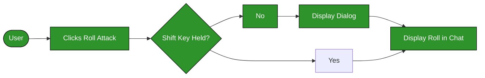
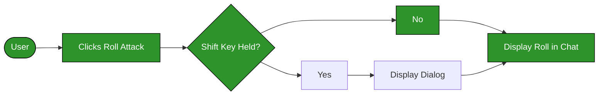

# Nimble ROlling for DnD5e

# TODO Needs UPDATES

A module that makes using items faster by default in dnd5e.

This module is heavily inspired by [Minimal Rolling Enhancements for D&D5e (MRE)](https://github.com/ElfFriend-DnD/FVTT-Minimal-Rolling-Enhancements-DND5E).

## Configurability

### Roll Configuration Dialog Behavior

The main difference someone may notice with this module is that they are prompted less often to configure a roll being made.

#### Core Behavior -- Skip Roll Dialogs: False

The core 5e system behavior is to always prompt the user when making a dice roll which might have a situational bonus, advantage, or disadvantage. It allows skipping this dialog by holding Shift when clicking on a roll button.

User flow with no Shift Key held is Highlighted.

#### Module Behavior -- Skip Roll Dialogs: True

This module allows GMs to configure the opposite behavior as the default: Do Not prompt the user when making a dice roll _unless_ they are holding Shift when clicking the roll button.

Players have the ability to opt out of this setting and set their own desired behavior.

User flow with no Shift Key held is Highlighted.

### Item Usage Behavior

Allows GMs to configure whether Items automatically roll any or all of the following when "used":
- Attack Rolls and Tool Checks
- Damage Rolls
    - Always rolls the First Rollgroup if "[Roll Groups](https://github.com/krbz999/rollgroups)" is active.
- Rollable Tables (via [Items With Rollable Tables DnD5e](https://foundryvtt.com/packages/items-with-rolltables-5e))

Super Charged by:
- [Retroactive Advantage D&D5e](https://github.com/ElfFriend-DnD/foundryvtt-retroactive-advantage-5e)
- [Roll Groups](https://github.com/krbz999/rollgroups)
- [Attack Roll Check D&D5e](https://github.com/ElfFriend-DnD/foundryvtt-attack-roll-check-5e)
- [Items With Rollable Tables DnD5e](https://github.com/ElfFriend-DnD/foundryvtt-items-with-rolltables-5e)

Compatible with:
- Core dnd5e roller

Partial Compatibility with:
- [Advantage Reminder](https://github.com/kaelad02/adv-reminder) -- Some configurations and effect setups will interrupt a normally skipped roll dialog to remind you about things. Improved Integration is a Work in Progress.

Unknown Compatibility with:
- Ready Set Roll

Not Compatible with:
- Midi QOL -- Midi can do everything this modules does and more, you don't need this if you're running with Midi.